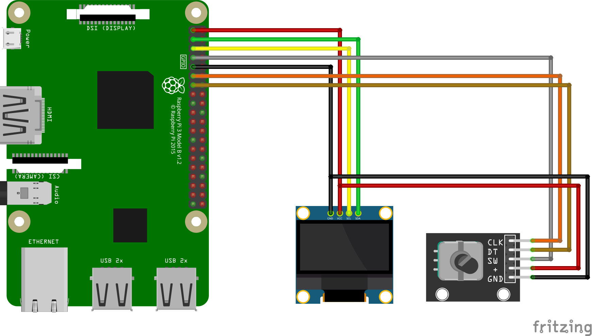

# Voron0.1_skirt_OLEDandRotaryEncoder

Voron0.1: 0.96インチOLE&ロータリーエンコーダーをスカートに内蔵

OLEDとロータリエンコーダーは、MCUボードを経由せずにRaspberryPiに直接配線するので、MCUボードの種類に関係なく設定できます。  
なので、Voron0.1以外でもKlipperで動作する3Dプリンターに応用できます。

## 完成形


## 部品

- 0.96インチOLED

    [https://amzn.to/3zsqpv](https://amzn.to/3zsqpv2)

- ロータリーエンコーダー

    [https://amzn.to/3hOiPFf](https://amzn.to/3hOiPFf)

    ３つのスイッチ全てにプルアップ抵抗がついてるもの

- M2 x 4mm タッピングビス ４本

## 配線図



rpi:3.3v —- OLED:VCC, RENC:+

rpi:GPIO2(SDA1) —- OLED:SDA 

rpi:GPIO3(SCL1) —- OLED:SCL

rpi:GPIO4 —- RENC:SW

rpi:GND —- OLED:GND, RENC:GND

rpi:GPIO17 —- RENC:CLK

rpi:GPIO27 —- RENC:DT

## ケーブル作成

ケーブル長は、75cmぐらい。

### VCCとGNDを二股にする

追加するケーブルは、ながさ12cmぐらい。

途中の被覆を剥いて、そこに追加の配線を巻いてハンダ。


そして、熱収縮チューブを被せる。


QIコネクタを取り付け


### OLEDのピンを曲げる

取り付けた時にコネクタが電源ユニットに当たるので、当たらないようにコネクタに角度をつけるためピンを曲げる。

スカートの厚さからコネクタが出ないくらいに曲げる。


### スカートにOLEDを取り付け

M2x4mmのタッピングビス４本で取り付け。


### スカートにロータリーエンコーダ取り付け

付属のナットで取り付け。


## configファイル

```
[mcu rpi]
serial: /tmp/klipper_host_mcu

[display]
lcd_type: ssd1306
i2c_mcu: rpi
i2c_bus: i2c.1
i2c_address: 60 #(0x3c) 
encoder_pins: rpi:gpio17, rpi:gpio27
click_pin: !rpi:gpio4
```

※以下の手順でセカンダリーMCUとしてRaspberryPiを指定できるようにしておく必要があります。  
[RPi microcontroller \- Klipper documentation](https://www.klipper3d.org/RPi_microcontroller.html)
## 元にしたSTLデータ

* [VoronUsers/printer_mods/mpfl/V0.1_skirt_OLED at master · VoronDesign/VoronUsers](https://github.com/VoronDesign/VoronUsers/tree/master/printer_mods/mpfl/V0.1_skirt_OLED)

* [Customizable Knob! by charliearmorycom](https://www.thingiverse.com/thing:54024)

## 投げ銭

[Amazonギフト券](https://amzn.to/39yuS50)  
受取人に、 `giftforseya+v01OLED@gmail.com`を入れてください。  
15円から投げ銭可能ですので、気に入ったらよろしくお願いします。

